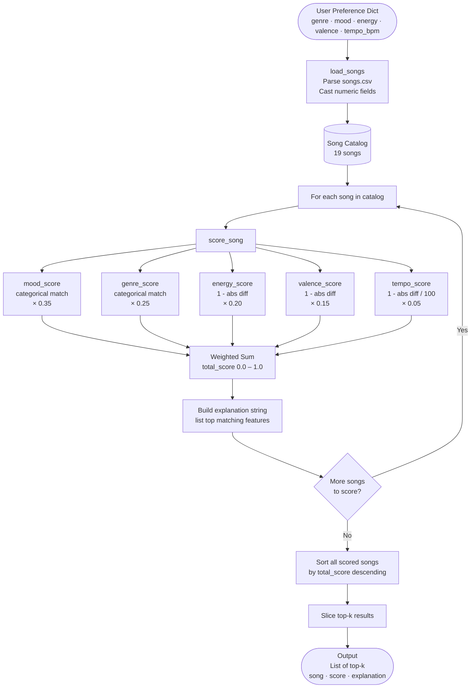

# 🎵 Music Recommender Simulation

## Project Summary

In this project you will build and explain a small music recommender system.

Your goal is to:

- Represent songs and a user "taste profile" as data
- Design a scoring rule that turns that data into recommendations
- Evaluate what your system gets right and wrong
- Reflect on how this mirrors real world AI recommenders

This simulation builds a content-based music recommender that scores songs against a user's taste profile using weighted feature similarity. It prioritizes mood and genre as the strongest signals of musical "vibe," then layers in numeric proximity scoring for energy, valence, and tempo to fine-tune rankings. Unlike real-world systems such as Spotify, which combine collaborative filtering across millions of users with deep audio analysis, this version works entirely from song attributes — no listening history, no social signals, just how well a song's character matches what a user says they want.

---

## How The System Works

Real-world recommenders like Spotify blend two major approaches: collaborative filtering (finding patterns across millions of users with similar taste) and content-based filtering (matching songs to a listener based on the song's own attributes like tempo, mood, and energy). Spotify also crawls music blogs and social media to build "cultural vectors" — learning how the world describes a song, not just what it sounds like. This simulation focuses on the content-based side: it compares a user's stated preferences directly against each song's features and ranks songs by how closely they match. The system prioritizes mood and genre as hard categorical signals, then uses numeric proximity scoring for energy, valence, and tempo so that songs *closer* to a user's preference score higher — not just songs with the highest or lowest values.

### Song Features

Each `Song` object stores:

| Feature | Type | Description |
|---|---|---|
| `id` | int | Unique identifier |
| `title` | str | Song title |
| `artist` | str | Artist name |
| `genre` | str | Genre (pop, lofi, rock, ambient, jazz, synthwave, indie pop) |
| `mood` | str | Mood tag (happy, chill, intense, relaxed, focused, moody) |
| `energy` | float | Perceptual intensity, 0.0–1.0 |
| `tempo_bpm` | int | Beats per minute |
| `valence` | float | Musical positivity, 0.0–1.0 (high = happy, low = sad/tense) |
| `danceability` | float | Rhythm regularity and beat strength, 0.0–1.0 |
| `acousticness` | float | Likelihood of acoustic instruments, 0.0–1.0 |

### UserProfile Features

Each `UserProfile` object stores the user's preferences across the same dimensions:

| Feature | Type | Description |
|---|---|---|
| `genre` | str | Preferred genre |
| `mood` | str | Desired mood |
| `energy` | float | Target energy level, 0.0–1.0 |
| `valence` | float | Target emotional positivity, 0.0–1.0 |
| `tempo_bpm` | int | Preferred tempo in BPM |

### Algorithm Recipe

The recommender runs four steps:

**Step 1 — Load.** Parse `data/songs.csv` into a list of song dicts, casting numeric fields to `float`/`int`.

**Step 2 — Score every song.** For each song, compute a weighted similarity score against the user profile:

```
total_score = (0.35 × mood_score)
            + (0.25 × genre_score)
            + (0.20 × energy_score)
            + (0.15 × valence_score)
            + (0.05 × tempo_score)
```

Categorical features use partial-credit affinity maps so sonically adjacent labels aren't penalized as harshly as completely unrelated ones:

| Feature | Exact match | Related match | No match |
|---|---|---|---|
| Mood | 1.0 | 0.5 | 0.0 |
| Genre | 1.0 | 0.5 | 0.0 |

Related mood pairs: `(chill, relaxed)`, `(chill, focused)`, `(focused, relaxed)`, `(happy, relaxed)`, `(intense, moody)`, `(moody, chill)`, `(intense, euphoric)`, `(euphoric, happy)`

Related genre pairs: `(lofi, ambient)`, `(lofi, jazz)`, `(pop, indie pop)`, `(pop, edm)`, `(rock, metal)`, `(synthwave, edm)`

Numeric features use proximity scoring — closer to the user's target = higher score:

```
energy_score  = 1 - abs(song.energy    - user.target_energy)
valence_score = 1 - abs(song.valence   - user.target_valence)
tempo_score   = 1 - abs(song.tempo_bpm - user.target_tempo_bpm) / 100
```

**Step 3 — Explain.** Record which features matched and by how much as a human-readable string returned alongside each result.

**Step 4 — Rank and return.** Sort all scored songs by `total_score` descending, slice the top-k, and return a list of `(song, score, explanation)` tuples.

### Data Flow



### Expected Biases and Limitations

- **Genre over-penalizes adjacent styles.** Even with partial credit, a lofi fan will rarely see an ambient or jazz song crack the top results because genre carries 25% of the weight and non-lofi genres score at most 0.5. Great songs in related genres get structurally disadvantaged.
- **Mood vocabulary mismatch.** The catalog contains 11 distinct moods but most user profiles only target 4–5 of them. Songs tagged `confident`, `nostalgic`, or `romantic` can never score above 0 on mood, regardless of how well their numerics match — they compete on only 40% of the scoring surface.
- **New moods are invisible.** If a new song is added to the CSV with a mood not in the affinity map, it will always score 0 on mood unless the map is manually updated. The system does not generalize to unseen labels.
- **Numeric features cannot rescue a bad categorical miss.** Even a perfect energy + valence + tempo match only contributes 0.40 to the score. A song with the wrong genre and mood is capped at 0.40 total — it can never beat a song with even one categorical match.
- **No diversity enforcement.** The top-k results can all be from the same genre or artist if those happen to score highest. There is no mechanism to spread recommendations across styles.
- **Static taste profile.** The system assumes the user's preferences are fixed. It has no concept of context (time of day, current session mood) or preference drift over time.

---

## Getting Started

### Setup

1. Create a virtual environment (optional but recommended):

   ```bash
   python -m venv .venv
   source .venv/bin/activate      # Mac or Linux
   .venv\Scripts\activate         # Windows

2. Install dependencies

```bash
pip install -r requirements.txt
```

3. Run the app:

```bash
python -m src.main
```

### Running Tests

Run the starter tests with:

```bash
pytest
```

You can add more tests in `tests/test_recommender.py`.

---

## Experiments You Tried

Use this section to document the experiments you ran. For example:

- What happened when you changed the weight on genre from 2.0 to 0.5
- What happened when you added tempo or valence to the score
- How did your system behave for different types of users

---

## Limitations and Risks

Summarize some limitations of your recommender.

Examples:

- It only works on a tiny catalog
- It does not understand lyrics or language
- It might over favor one genre or mood

You will go deeper on this in your model card.

---

## Reflection

Read and complete `model_card.md`:

[**Model Card**](model_card.md)

Write 1 to 2 paragraphs here about what you learned:

- about how recommenders turn data into predictions
- about where bias or unfairness could show up in systems like this


---

## 7. `model_card_template.md`

Combines reflection and model card framing from the Module 3 guidance. :contentReference[oaicite:2]{index=2}  

```markdown
# 🎧 Model Card - Music Recommender Simulation

## 1. Model Name

Give your recommender a name, for example:

> VibeFinder 1.0

---

## 2. Intended Use

- What is this system trying to do
- Who is it for

Example:

> This model suggests 3 to 5 songs from a small catalog based on a user's preferred genre, mood, and energy level. It is for classroom exploration only, not for real users.

---

## 3. How It Works (Short Explanation)

Describe your scoring logic in plain language.

- What features of each song does it consider
- What information about the user does it use
- How does it turn those into a number

Try to avoid code in this section, treat it like an explanation to a non programmer.

---

## 4. Data

Describe your dataset.

- How many songs are in `data/songs.csv`
- Did you add or remove any songs
- What kinds of genres or moods are represented
- Whose taste does this data mostly reflect

---

## 5. Strengths

Where does your recommender work well

You can think about:
- Situations where the top results "felt right"
- Particular user profiles it served well
- Simplicity or transparency benefits

---

## 6. Limitations and Bias

Where does your recommender struggle

Some prompts:
- Does it ignore some genres or moods
- Does it treat all users as if they have the same taste shape
- Is it biased toward high energy or one genre by default
- How could this be unfair if used in a real product

---

## 7. Evaluation

How did you check your system

Examples:
- You tried multiple user profiles and wrote down whether the results matched your expectations
- You compared your simulation to what a real app like Spotify or YouTube tends to recommend
- You wrote tests for your scoring logic

You do not need a numeric metric, but if you used one, explain what it measures.

---

## 8. Future Work

If you had more time, how would you improve this recommender

Examples:

- Add support for multiple users and "group vibe" recommendations
- Balance diversity of songs instead of always picking the closest match
- Use more features, like tempo ranges or lyric themes

---

## 9. Personal Reflection

A few sentences about what you learned:

- What surprised you about how your system behaved
- How did building this change how you think about real music recommenders
- Where do you think human judgment still matters, even if the model seems "smart"

