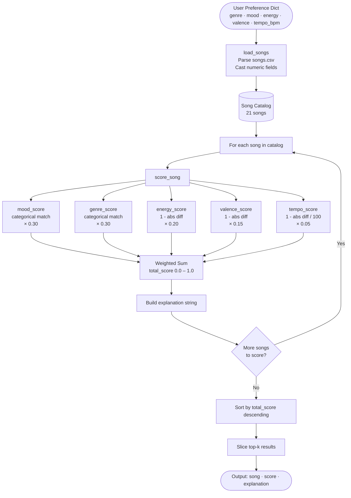
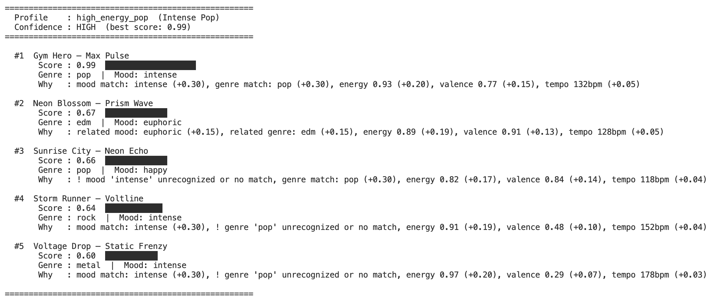
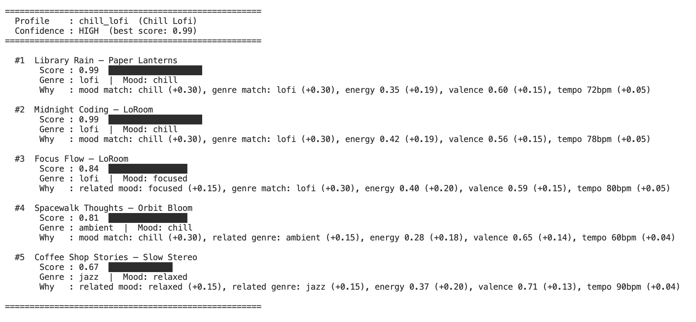
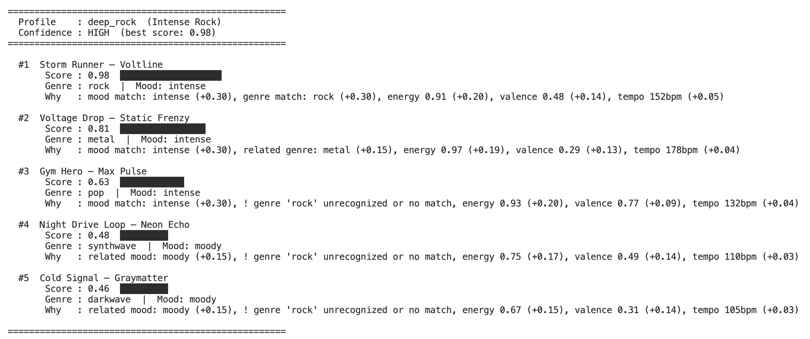
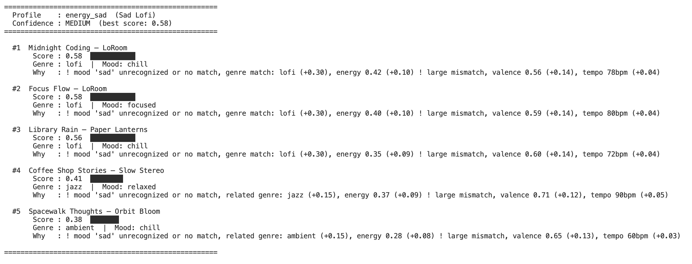
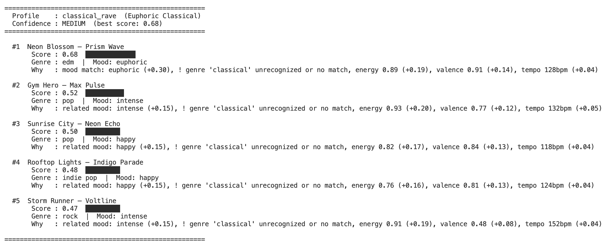
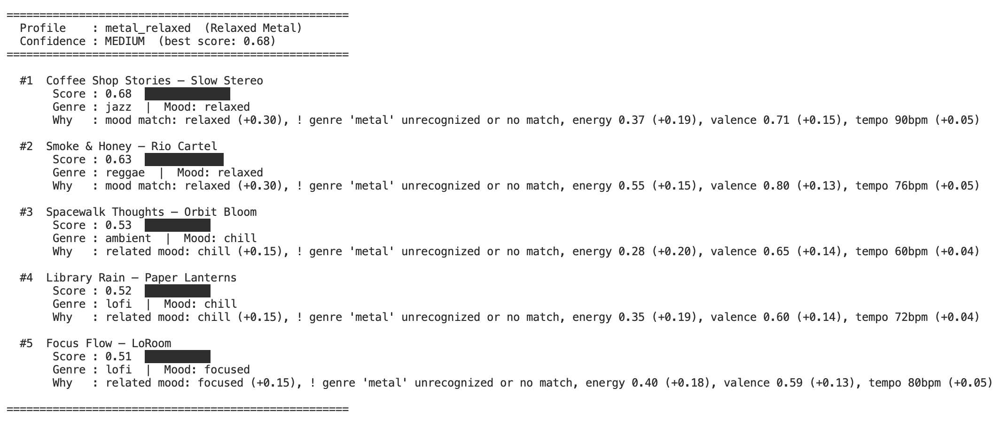
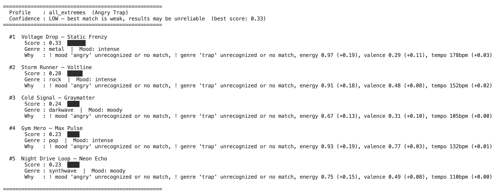

# Music Recommender Simulation

A content-based music recommender that scores songs against a user's taste profile using weighted feature similarity. Built as a CLI-first Python simulation to explore how recommendation algorithms work under the hood.

---

## Overview

This project implements a content-based filtering approach to music recommendation. It compares a user's stated preferences — genre, mood, energy, valence, and tempo — directly against song attributes in a 21-song catalog. Songs closer to the user's target profile score higher. There is no listening history and no collaborative filtering; recommendations are driven entirely by how well a song's character matches what a user asks for.

---

## How It Works

### Scoring Formula

Each song receives a weighted similarity score from 0.0 to 1.0:

```
total_score = (0.30 × mood_score)
            + (0.30 × genre_score)
            + (0.20 × energy_score)
            + (0.15 × valence_score)
            + (0.05 × tempo_score)
```

**Categorical features** (mood, genre) use partial-credit affinity maps — sonically adjacent labels earn half credit rather than zero:

| Match type | Score |
|---|---|
| Exact match | 1.0 |
| Related pair (e.g. lofi ↔ ambient) | 0.5 |
| No relationship | 0.0 |

**Numeric features** use proximity scoring — closer to the user's target = higher score:

```
energy_score  = 1 - abs(song.energy - user.target_energy)
valence_score = 1 - abs(song.valence - user.target_valence)
tempo_score   = max(0, 1 - abs(song.tempo_bpm - user.target_tempo_bpm) / 100)
```

A **confidence label** (HIGH / MEDIUM / LOW) is shown based on the top result's score.

### Data Flow



### Song Features

| Feature | Type | Description |
|---|---|---|
| `genre` | str | Musical genre |
| `mood` | str | Mood tag |
| `energy` | float | Perceptual intensity, 0.0–1.0 |
| `tempo_bpm` | int | Beats per minute |
| `valence` | float | Emotional positivity, 0.0–1.0 |
| `danceability` | float | Rhythm regularity, 0.0–1.0 |
| `acousticness` | float | Acoustic instrument likelihood, 0.0–1.0 |

### User Profile Fields

| Field | Type | Description |
|---|---|---|
| `favorite_genre` | str | Preferred genre |
| `favorite_mood` | str | Desired mood |
| `target_energy` | float | Target energy level |
| `target_valence` | float | Target emotional tone |
| `target_tempo_bpm` | int | Preferred tempo in BPM |

---

## Example Output









---

## Getting Started

### Setup

1. Create and activate a virtual environment:

   ```bash
   python -m venv .venv
   source .venv/bin/activate      # Mac / Linux
   .venv\Scripts\activate         # Windows
   ```

2. Install dependencies:

   ```bash
   pip install -r requirements.txt
   ```

3. Run the recommender:

   ```bash
   python -m src.main
   ```

To switch profiles, edit this line in `src/main.py`:

```python
stress_test_profiles = ["high_energy_pop", "chill_lofi", "deep_rock"]
```

Available profiles: `night_study`, `workout`, `sunday_chill`, `night_drive`, `pop/happy`, `high_energy_pop`, `chill_lofi`, `deep_rock`

### Running Tests

```bash
pytest
```

---

## Project Structure

```
Music_Recommender_Simulation/
├── data/
│   └── songs.csv           # 21-song catalog
├── screenshots/            # CLI output screenshots
├── src/
│   ├── main.py             # Entry point, profiles, formatted output
│   └── recommender.py      # Song, UserProfile, scoring logic
├── tests/
│   └── test_recommender.py
├── model_card.md           # Full model documentation and bias analysis
├── reflection.md           # Profile comparison notes
└── README.md
```

---

## Known Limitations

- **Small catalog** — 21 songs, most genres have only 1 representative.
- **No diversity enforcement** — top results can cluster around one artist or genre.
- **Static profiles** — no concept of session context or preference drift over time.
- **Unused features** — `danceability` and `acousticness` are loaded but not scored.
- **Unknown labels** — moods or genres outside the affinity maps silently score zero.

See [model_card.md](model_card.md) for a full bias and limitations analysis.

---

## Documentation

- [Model Card](model_card.md) — algorithm details, bias analysis, evaluation results, and personal reflection
- [Reflection](reflection.md) — side-by-side profile comparisons explaining why outputs differ
